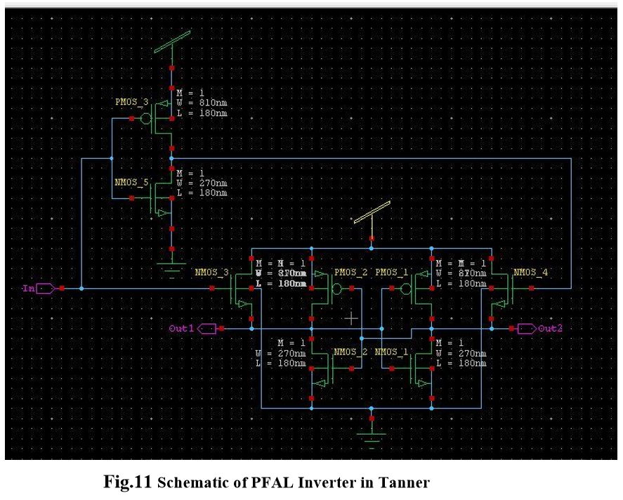

# ADIABATIC_TECHNIQUE_FOR_POWER_EFFICIENT_LOGIC_CIRCUIT_DESIGN

# ABSTRACT

Power consumption plays a major role in present day VLSI design technology. The demand for low power consuming devices increasing rapidly and the adiabatic logic style is said to be attractive solution. The Power dissipation in conventional CMOS circuits can be reduced through adiabatic technique. In which adiabatic circuits can be minimized more than 90% as compared to conventional CMOS logic.  In adiabatic circuit the charge stored in load capacitor is recovered while in conventional CMOS it is transferred to ground which causes wastage of energy. But the adiabatic technique is highly dependent on parameter variation. With the help of SPICE simulations, the energy consumption is analysed by variation of parameter. In analysis two logic families, ECRL (Efficient Charge Recovery Logic) and PFAL (Positive Feedback Adiabatic Logic) are compared with conventional CMOS logic for inverter circuit. It is finding that adiabatic technique is good choice for low power application in specified frequency range. Circuit simulation is carried out in Tanner EDA tools. 

# INTRODUCTION 

The term “Adiabatic” describe the thermodynamic processes in which no energy exchange between the system and the external environment, and therefore no dissipated energy loss. But in VLSI, the electric charge transfer between nodes of a circuit is considered as the process and various techniques can be applied to minimize the energy loss during charge transfer event. Fully adiabatic operation of a circuit is an ideal condition. It may be only achieved with very slow switching speed. In practical cases, energy dissipation with a charge transfer event is composed of an adiabatic component and a non-adiabatic component. In conventional CMOS logic circuits, from 0 to VDD transition of the output node, the total output energy drawn from power supply and stored in capacitive network. Adiabatic logic circuits reduce the energy dissipation during switching process, and utilize this energy by recycling from the load capacitance. For recycling, the adiabatic circuits use the constant current source power supply and for reduce dissipation it uses the trapezoidal or sinusoidal power supply voltage.
The equivalent circuit used to model the conventional CMOS circuits during charging process of the output load capacitance. But here constant voltage source is replaced with the constant current source to charge and discharge the output load capacitance. Hence adiabatic switching technique offers the less energy dissipation in PMOS network and reuses the stored energy in the output load capacitance by reversing the current source. Adiabatic circuits are low power circuits which use “reversible logic” to conserve energy. In this report, several adiabatic techniques like ECRL, PFAL analysed using inverter circuit for power dissipation. Tanner EDA tools is used for circuit implementation and simulation. Transistor count for implementation ECRL and PFAL are 4 and 6 respectively.  Power consumed in inverter using ECRL and PFAL are observed to be ,13.402µW  and 21.152µW  respectively.  From the result it is found that adiabatic technique PFAL is better than ECRL based circuit. 

# CMOS LOGICAL FAMILIES 

  Types of CMOS logic circuits are: 
  • CMOS INVERTER 
  • CMOS NAND 
  • CMOS NOR  
  But in this report, we only use CMOS inverter for comparison with adiabatic circuits. 

# ➢ CMOS INVERTER

The term CMOS stands for “Complementary Metal Oxide Semiconductor”. In CMOS inverter It consists of only two transistors, a pair of one N-type and one P-type transistor. The input Vin serves as the gate voltage for both transistors. The NMOS transistor has an input from ground and PMOS transistor has an input from Vdd. The terminal Vout is output. 

As in fig 1. When Vin is high and equal to Vdd the NMOS transistor is ON and the PMOS is OFF. Hence direct current flows from Vout and the ground which shows that Vout = 0 V. On the other hand, when Vin is low then NMOS transistor is OFF and PMOS transistor is ON. 

Above Fig.2  schematic circuit has been made by using Tanner tools on S-edit for simulation. In which width of PMOS is 3 times greater than NMOS i.e 810nm in PMOS and 270nm in NMOS. 

# SIMULATION RESULTS 

The results are verified for various combination of CMOS inverter:

# Power Dissipation

# ADIABATIC LOGIC FAMILIES 

There is no. of adiabatic technique like ECRL, PFAL, SCAL, CAL, and NERL. Here We use only two types of adiabatic logic circuits ECRL and PFAL for comparative study. 

# o ECRL 
Efficient Charge Recovery Logic (ECRL) is proposed as a candidate for low-energy adiabatic logic circuit. Power comparison with other logic circuits is performed on an inverter chain. It adopts a new method that performs pre-charge and evaluation simultaneously. ECRL eliminates the pre-charge diode and dissipates less energy than other adiabatic circuits. An ECRL inverter chain and a pipelined Carry Look Ahead Adder (CLA) are constructed to show the effectiveness of this approach.

# 1. ECRL Inverter 
It consists of two cross-coupled transistors m1 and m2 and two N-functional blocks for the ECRL adiabatic logic block.  Power clock is used  for  ECRL  gates,  so  as  to recover and reuse the supplied energy. Both out and out bar are generated. 

Initially, input ‘in’ is high and input ‘/in’ is low. When power clock (pck) rises from zero to VDD, output ‘out’ remains ground level. Output ‘/out’ follows the pck When pck reaches at VDD, outputs ‘out’ and ‘/out’ hold logic value zero and VDD respectively. This output values can be used for the next stage as an inputs. Now pck falls from VDD to zero, ‘/out’ returns its energy to pck hence delivered charge is recovered. ECRL uses four phase clocking rule to efficiently recover the charge delivered by pck/vdd. 

# SIMULATION RESULTS

# Power Dissipation 

From above results we can see that in ECRL inverter Average Power consumed is less as compare to CMOS inverter. 

# o PFAL (Positive Feedback Adiabatic Logic)

The schematic and of the PFAL inverter gate is shown below in Fig.10. Initially, input ‘in’ is high and input ‘/in’ is low. When power clock (pck) rises from zero to VDD, output ‘out’ remains ground level. Output ‘/out’ follows the pck. When pck reaches at VDD, outputs ‘out’ and ‘/out’ hold logic value zero and VDD respectively. This output values can be used for the next stage as an inputs. Now pck falls from VDD to zero, ‘/out’ returns its energy to pck hence delivered charge is recovered. PFAL uses four phase clocking rule to efficiently recover the charge delivered by pck.

In this circuit we use three NMOS and PMOS and one inverter for out waveform.  

# SIMULATION RESULTS 

# Power Dissipation 

From above results we can see that Average power consumed in PFAL Inverter 21.15uW is also less than as compare to ECRL inverter circuits. here it is found that adiabatic technique PFAL is better than ECRL based circuit.

# Power Consumption Comparison and Verification
Following are the parameters on which the power consumption of circuits are to be compared. 
o Transition Frequency Variation 
o Load Capacitance Variation 
o Supply Voltage Variation 

# 1. Transition Frequency Variation 
Power dissipation per cycle versus switching frequency of the two adiabatic logic families    and CMOS for the inverter logic. 

# 2. Load Capacitance Variation
Fig. 15 shows the power dissipation per cycle versus load capacitance of the two adiabatic logic families and CMOS for the inverter logic.

# 3.Supply Voltage Variation

# CONCLUSION 
From the above results, it can be concluded that circuits based on adiabatic techniques consumes very less power as compared to its conventional counterparts. here less energy consumption in adiabatic logic families can be still achieved than CMOS logic over the wide range of parameter variations. PFAL shows better energy savings than ECRL at the high frequency and high load capacitance.  ECRL is a low-energy, adiabatic logic. Simulation indicates power saving over static and other adiabatic logic families. The ECRL inverter chain shows 10-20 times power gain over a conventional inverter chain. ECRL shows large power saving and shows the promising usage of ECRL in a low power system. PFAL has the potential to be used to implement arbitrary reversible logic functions. It has also been shown that by making PFAL fully reversible, considerably reduced power consumption can be obtained.in adiabatic we get output as the function and its complement and requires special power supply. 
